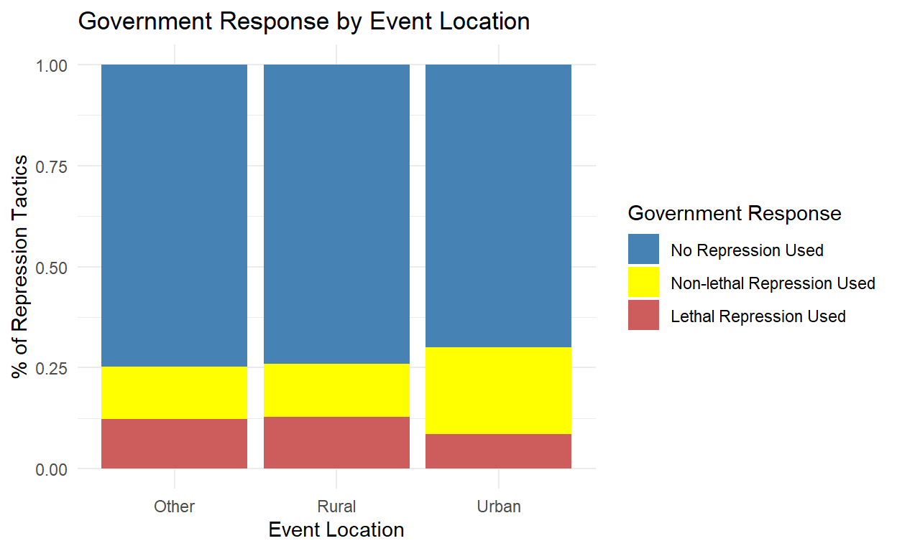
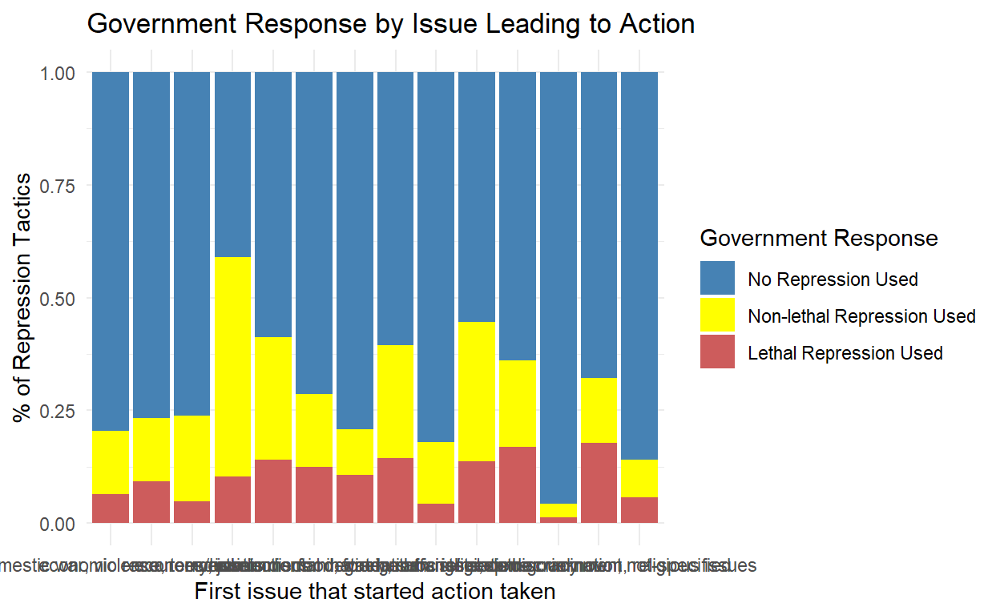

## Introduction

The research question at the heart of this study explores the relationship between the use of repression or violence by African governments and the geographical location of events, encompassing both violent and nonviolent actions. The hypothesis claims that events occurring in capital cities or major urban areas are more likely to face government repression, contrasting with relatively lower repression in rural settings. The rationale behind this hypothesis stems from the belief that major urban areas provide a conducive environment for mobilization and resource allocation during events, thereby posing a greater perceived threat to the government and resulting in more substantial repression. The significance of this study lies in understanding the patterns of government response to events across different locations in Africa.

## Data Section 

The data for this study is drawn from the Social Conflict Analysis Database (SCAD), encompassing information on both violent and nonviolent actions in Africa. The unit of analysis is the event, with the key explanatory variable being the location of the event, categorized into various codes representing capital cities, major urban areas, rural settings, and more. The outcome variable of interest is "repress," capturing the government's use of repression or violence in response to participants in the event. The coding of the repression variable distinguishes between no repression, non-lethal repression (e.g., tear gas, arrests), and lethal repression (involving reported deaths).

The research design employed is cross-sectional, focusing on a snapshot of events to analyze the relationship between location and government repression. To visualize the data, a plot has been generated to depict the proportions of government responses across different locations, providing a preliminary overview of the patterns observed. This study aims to use regression analysis to delve deeper into the relationship between the count of events in urban areas and major cities and the repression variable. A positive and significant coefficient in the regression results would show support to the hypothesis, indicating a higher likelihood of government repression in major urban areas.

# Data Visualization of Outcome of Interest


<div class="layout-chunk" data-layout="l-body">
<div class="sourceCode"><pre class="sourceCode r"><code class="sourceCode r"><span><span class='kw'><a href='https://rdrr.io/r/base/library.html'>library</a></span><span class='op'>(</span><span class='va'><a href='https://tidyverse.tidyverse.org'>tidyverse</a></span><span class='op'>)</span></span>
<span></span>
<span><span class='va'>Data1</span> <span class='op'>&lt;-</span> <span class='fu'><a href='https://readr.tidyverse.org/reference/read_delim.html'>read_csv</a></span><span class='op'>(</span><span class='st'>"C:\\Users\\temit\\OneDrive\\GOV50\\Final GOV 50 Project\\SCAD2018Africa_Final.csv"</span><span class='op'>)</span></span>
<span></span>
<span></span>
<span><span class='co'># Create a binary variable for urban or rural</span></span>
<span><span class='va'>Data1</span> <span class='op'>&lt;-</span> <span class='va'>Data1</span> <span class='op'>|&gt;</span></span>
<span>  <span class='fu'><a href='https://dplyr.tidyverse.org/reference/mutate.html'>mutate</a></span><span class='op'>(</span>urban_rural <span class='op'>=</span> <span class='fu'><a href='https://dplyr.tidyverse.org/reference/case_when.html'>case_when</a></span><span class='op'>(</span></span>
<span>    <span class='va'>locnum</span> <span class='op'><a href='https://rdrr.io/r/base/match.html'>%in%</a></span> <span class='fu'><a href='https://rdrr.io/r/base/c.html'>c</a></span><span class='op'>(</span><span class='fl'>1</span>, <span class='fl'>2</span>, <span class='fl'>4</span><span class='op'>)</span> <span class='op'>~</span> <span class='st'>"Urban"</span>,</span>
<span>    <span class='va'>locnum</span> <span class='op'><a href='https://rdrr.io/r/base/match.html'>%in%</a></span> <span class='fu'><a href='https://rdrr.io/r/base/c.html'>c</a></span><span class='op'>(</span><span class='fl'>3</span>, <span class='fl'>5</span><span class='op'>)</span> <span class='op'>~</span> <span class='st'>"Rural"</span>,</span>
<span>    <span class='va'>locnum</span> <span class='op'><a href='https://rdrr.io/r/base/match.html'>%in%</a></span> <span class='fu'><a href='https://rdrr.io/r/base/c.html'>c</a></span><span class='op'>(</span><span class='fl'>6</span>, <span class='fl'>7</span>, <span class='op'>-</span><span class='fl'>99</span><span class='op'>)</span> <span class='op'>~</span> <span class='st'>"Other"</span>,</span>
<span>    <span class='cn'>TRUE</span> <span class='op'>~</span> <span class='st'>"Other"</span></span>
<span>  <span class='op'>)</span><span class='op'>)</span></span>
<span></span>
<span></span>
<span><span class='co'># Rename the "repress" variable to "GovResponse"</span></span>
<span><span class='va'>Data1</span> <span class='op'>&lt;-</span> <span class='va'>Data1</span> <span class='op'>|&gt;</span></span>
<span>  <span class='fu'><a href='https://dplyr.tidyverse.org/reference/mutate.html'>mutate</a></span><span class='op'>(</span>GovResponse <span class='op'>=</span> <span class='fu'><a href='https://rdrr.io/r/base/factor.html'>factor</a></span><span class='op'>(</span><span class='va'>repress</span>, levels <span class='op'>=</span> <span class='fu'><a href='https://rdrr.io/r/base/c.html'>c</a></span><span class='op'>(</span><span class='st'>"0"</span>, <span class='st'>"1"</span>, <span class='st'>"2"</span><span class='op'>)</span><span class='op'>)</span><span class='op'>)</span></span>
<span></span>
<span><span class='co'># Create a data visualization</span></span>
<span><span class='va'>Data1</span> <span class='op'>|&gt;</span></span>
<span>  <span class='fu'><a href='https://dplyr.tidyverse.org/reference/group_by.html'>group_by</a></span><span class='op'>(</span><span class='va'>urban_rural</span>, <span class='va'>GovResponse</span><span class='op'>)</span> <span class='op'>|&gt;</span></span>
<span>  <span class='fu'><a href='https://dplyr.tidyverse.org/reference/summarise.html'>summarize</a></span><span class='op'>(</span>Count <span class='op'>=</span> <span class='fu'><a href='https://dplyr.tidyverse.org/reference/context.html'>n</a></span><span class='op'>(</span><span class='op'>)</span><span class='op'>)</span> <span class='op'>|&gt;</span></span>
<span>  <span class='fu'><a href='https://dplyr.tidyverse.org/reference/group_by.html'>group_by</a></span><span class='op'>(</span><span class='va'>urban_rural</span><span class='op'>)</span> <span class='op'>|&gt;</span></span>
<span>  <span class='fu'><a href='https://dplyr.tidyverse.org/reference/mutate.html'>mutate</a></span><span class='op'>(</span>Proportion <span class='op'>=</span> <span class='va'>Count</span> <span class='op'>/</span> <span class='fu'><a href='https://rdrr.io/r/base/sum.html'>sum</a></span><span class='op'>(</span><span class='va'>Count</span><span class='op'>)</span><span class='op'>)</span> <span class='op'>|&gt;</span></span>
<span>  <span class='fu'><a href='https://ggplot2.tidyverse.org/reference/ggplot.html'>ggplot</a></span><span class='op'>(</span><span class='fu'><a href='https://ggplot2.tidyverse.org/reference/aes.html'>aes</a></span><span class='op'>(</span>x <span class='op'>=</span> <span class='va'>urban_rural</span>, y <span class='op'>=</span> <span class='va'>Proportion</span>, fill <span class='op'>=</span> <span class='va'>GovResponse</span><span class='op'>)</span><span class='op'>)</span> <span class='op'>+</span></span>
<span>  <span class='fu'><a href='https://ggplot2.tidyverse.org/reference/geom_bar.html'>geom_bar</a></span><span class='op'>(</span>stat <span class='op'>=</span> <span class='st'>"identity"</span><span class='op'>)</span> <span class='op'>+</span></span>
<span>  <span class='fu'><a href='https://ggplot2.tidyverse.org/reference/labs.html'>labs</a></span><span class='op'>(</span></span>
<span>    title <span class='op'>=</span> <span class='st'>"Government Response by Event Location"</span>,</span>
<span>    x <span class='op'>=</span> <span class='st'>"Event Location"</span>,</span>
<span>    y <span class='op'>=</span> <span class='st'>"% of Repression Tactics"</span>,</span>
<span>    fill <span class='op'>=</span> <span class='st'>"Government Response"</span></span>
<span>  <span class='op'>)</span> <span class='op'>+</span></span>
<span>  <span class='fu'><a href='https://ggplot2.tidyverse.org/reference/scale_manual.html'>scale_fill_manual</a></span><span class='op'>(</span></span>
<span>    values <span class='op'>=</span> <span class='fu'><a href='https://rdrr.io/r/base/c.html'>c</a></span><span class='op'>(</span><span class='st'>"0"</span> <span class='op'>=</span> <span class='st'>"steelblue"</span>, <span class='st'>"1"</span> <span class='op'>=</span> <span class='st'>"yellow"</span>, <span class='st'>"2"</span> <span class='op'>=</span> <span class='st'>"indianred"</span><span class='op'>)</span>,</span>
<span>    labels <span class='op'>=</span> <span class='fu'><a href='https://rdrr.io/r/base/c.html'>c</a></span><span class='op'>(</span><span class='st'>"No Repression Used"</span>, <span class='st'>"Non-lethal Repression Used"</span>, <span class='st'>"Lethal Repression Used"</span><span class='op'>)</span></span>
<span>  <span class='op'>)</span> <span class='op'>+</span></span>
<span>  <span class='fu'><a href='https://ggplot2.tidyverse.org/reference/ggtheme.html'>theme_minimal</a></span><span class='op'>(</span><span class='op'>)</span></span></code></pre></div>


</div>


## Results: Regression table for Event location and Government Response


<div class="layout-chunk" data-layout="l-body">
<div class="sourceCode"><pre class="sourceCode r"><code class="sourceCode r"><span><span class='co'># Load necessary libraries</span></span>
<span><span class='kw'><a href='https://rdrr.io/r/base/library.html'>library</a></span><span class='op'>(</span><span class='va'><a href='https://tidyverse.tidyverse.org'>tidyverse</a></span><span class='op'>)</span></span>
<span><span class='kw'><a href='https://rdrr.io/r/base/library.html'>library</a></span><span class='op'>(</span><span class='va'><a href='https://broom.tidymodels.org/'>broom</a></span><span class='op'>)</span></span>
<span></span>
<span><span class='co'># Create dummy variables for 'Non-Lethal Repression', 'Lethal Repression', and 'No Repression Used'</span></span>
<span><span class='va'>Data1</span> <span class='op'>&lt;-</span> <span class='va'>Data1</span> <span class='op'>|&gt;</span></span>
<span>  <span class='fu'><a href='https://dplyr.tidyverse.org/reference/mutate.html'>mutate</a></span><span class='op'>(</span></span>
<span>    NonLethalRepression <span class='op'>=</span> <span class='fu'><a href='https://rdrr.io/r/base/numeric.html'>as.numeric</a></span><span class='op'>(</span><span class='va'>repress</span> <span class='op'>==</span> <span class='fl'>1</span><span class='op'>)</span>,</span>
<span>    LethalRepression <span class='op'>=</span> <span class='fu'><a href='https://rdrr.io/r/base/numeric.html'>as.numeric</a></span><span class='op'>(</span><span class='va'>repress</span> <span class='op'>==</span> <span class='fl'>2</span><span class='op'>)</span>,</span>
<span>    NoRepression <span class='op'>=</span> <span class='fu'><a href='https://rdrr.io/r/base/numeric.html'>as.numeric</a></span><span class='op'>(</span><span class='va'>repress</span> <span class='op'>==</span> <span class='fl'>0</span><span class='op'>)</span></span>
<span>  <span class='op'>)</span></span>
<span></span>
<span><span class='co'># Fit logistic regression for "No Repression Used"</span></span>
<span><span class='va'>model_no_repression</span> <span class='op'>&lt;-</span> <span class='fu'><a href='https://rdrr.io/r/stats/glm.html'>glm</a></span><span class='op'>(</span><span class='va'>NoRepression</span> <span class='op'>~</span> <span class='va'>urban_rural</span>, data <span class='op'>=</span> <span class='va'>Data1</span>, family <span class='op'>=</span> <span class='st'>"binomial"</span><span class='op'>)</span></span>
<span></span>
<span><span class='co'># Fit logistic regression for "Non-Lethal Repression Used"</span></span>
<span><span class='va'>model_non_lethal_repression</span> <span class='op'>&lt;-</span> <span class='fu'><a href='https://rdrr.io/r/stats/glm.html'>glm</a></span><span class='op'>(</span><span class='va'>NonLethalRepression</span> <span class='op'>~</span> <span class='va'>urban_rural</span>, data <span class='op'>=</span> <span class='va'>Data1</span>, family <span class='op'>=</span> <span class='st'>"binomial"</span><span class='op'>)</span></span>
<span></span>
<span><span class='co'># Fit logistic regression for "Lethal Repression Used"</span></span>
<span><span class='va'>model_lethal_repression</span> <span class='op'>&lt;-</span> <span class='fu'><a href='https://rdrr.io/r/stats/glm.html'>glm</a></span><span class='op'>(</span><span class='va'>LethalRepression</span> <span class='op'>~</span> <span class='va'>urban_rural</span>, data <span class='op'>=</span> <span class='va'>Data1</span>, family <span class='op'>=</span> <span class='st'>"binomial"</span><span class='op'>)</span></span>
<span></span>
<span><span class='co'># Print summary for each model</span></span>
<span><span class='va'>summary_no_repression</span> <span class='op'>&lt;-</span> <span class='fu'><a href='https://generics.r-lib.org/reference/tidy.html'>tidy</a></span><span class='op'>(</span><span class='va'>model_no_repression</span><span class='op'>)</span></span>
<span><span class='va'>summary_non_lethal_repression</span> <span class='op'>&lt;-</span> <span class='fu'><a href='https://generics.r-lib.org/reference/tidy.html'>tidy</a></span><span class='op'>(</span><span class='va'>model_non_lethal_repression</span><span class='op'>)</span></span>
<span><span class='va'>summary_lethal_repression</span> <span class='op'>&lt;-</span> <span class='fu'><a href='https://generics.r-lib.org/reference/tidy.html'>tidy</a></span><span class='op'>(</span><span class='va'>model_lethal_repression</span><span class='op'>)</span></span>
<span></span>
<span><span class='co'># Display the summaries</span></span>
<span><span class='fu'><a href='https://rdrr.io/r/base/print.html'>print</a></span><span class='op'>(</span><span class='st'>"No Repression:"</span><span class='op'>)</span></span></code></pre></div>

```
[1] "No Repression:"
```

<div class="sourceCode"><pre class="sourceCode r"><code class="sourceCode r"><span><span class='fu'><a href='https://rdrr.io/r/base/print.html'>print</a></span><span class='op'>(</span><span class='va'>summary_no_repression</span><span class='op'>)</span></span></code></pre></div>

```
# A tibble: 3 × 5
  term             estimate std.error statistic   p.value
  <chr>               <dbl>     <dbl>     <dbl>     <dbl>
1 (Intercept)        1.08      0.0356    30.4   4.16e-203
2 urban_ruralRural  -0.0358    0.0493    -0.727 4.67e-  1
3 urban_ruralUrban  -0.235     0.0424    -5.55  2.81e-  8
```

<div class="sourceCode"><pre class="sourceCode r"><code class="sourceCode r"><span><span class='fu'><a href='https://rdrr.io/r/base/print.html'>print</a></span><span class='op'>(</span><span class='st'>"Non-Lethal Repression:"</span><span class='op'>)</span></span></code></pre></div>

```
[1] "Non-Lethal Repression:"
```

<div class="sourceCode"><pre class="sourceCode r"><code class="sourceCode r"><span><span class='fu'><a href='https://rdrr.io/r/base/print.html'>print</a></span><span class='op'>(</span><span class='va'>summary_non_lethal_repression</span><span class='op'>)</span></span></code></pre></div>

```
# A tibble: 3 × 5
  term             estimate std.error statistic  p.value
  <chr>               <dbl>     <dbl>     <dbl>    <dbl>
1 (Intercept)      -1.89       0.0459  -41.3    0       
2 urban_ruralRural  0.00191    0.0638    0.0299 9.76e- 1
3 urban_ruralUrban  0.595      0.0526   11.3    1.19e-29
```

<div class="sourceCode"><pre class="sourceCode r"><code class="sourceCode r"><span><span class='fu'><a href='https://rdrr.io/r/base/print.html'>print</a></span><span class='op'>(</span><span class='st'>"Lethal Repression:"</span><span class='op'>)</span></span></code></pre></div>

```
[1] "Lethal Repression:"
```

<div class="sourceCode"><pre class="sourceCode r"><code class="sourceCode r"><span><span class='fu'><a href='https://rdrr.io/r/base/print.html'>print</a></span><span class='op'>(</span><span class='va'>summary_lethal_repression</span><span class='op'>)</span></span></code></pre></div>

```
# A tibble: 3 × 5
  term             estimate std.error statistic  p.value
  <chr>               <dbl>     <dbl>     <dbl>    <dbl>
1 (Intercept)       -1.97      0.0473   -41.7   0       
2 urban_ruralRural   0.0602    0.0650     0.927 3.54e- 1
3 urban_ruralUrban  -0.396     0.0604    -6.55  5.69e-11
```

</div>


## Interpretation of regression tables 

"The No Repression Model:

Intercept (Rural): The baseline likelihood of having 'No Repression' in rural areas is 1.08. This is our starting point.
Urban Coefficient: In urban areas, the likelihood of 'No Repression' is 0.04 lower than in rural areas, but this difference is not big enough to be sure it's not just due to chance (p =0.467).
Other Coefficient: In 'Other' areas, the likelihood of 'No Repression' is 0.24 lower than in rural areas, and this difference is highly statistically significant (p = 2.81e-08). Thus, in locations that do not neatly fit into the urban or rural categories, there is a substantial decrease in the likelihood of 'No Repression.'

The Non-Lethal Repression Model:
Intercept (Rural): The baseline likelihood of experiencing 'Non-Lethal Repression' in rural areas is -1.89. This sets our starting point.
Urban Coefficient: In urban areas, the likelihood of 'Non-Lethal Repression' is 0.0019 higher than in rural areas, but this small difference is not statistically significant (p = 0.976).
Other Coefficient: In 'Other' areas, the likelihood of 'Non-Lethal Repression' is 0.59 higher than in rural areas, and this difference is highly statistically significant (p = 1.19e-29). So, in places that don't neatly fit into urban or rural categories, there is a significant increase in the likelihood of 'Non-Lethal Repression.'

Lethal Repression Model:
Intercept (Rural): The baseline likelihood of experiencing 'Lethal Repression' in rural areas is -1.97. This is our starting point.
Urban Coefficient: In urban areas, the likelihood of 'Lethal Repression' is 0.06 higher than in rural areas, but this difference is not statistically significant (p = 0.354).
Other Coefficient: In 'Other' areas, the likelihood of 'Lethal Repression' is -0.40 lower than in rural areas, and this difference is highly statistically significant (p = 5.69e-11). So, in places that don't neatly fit into urban or rural categories, there is a significant decrease in the likelihood of 'Lethal Repression.'

These results indicate that the type of governmental response varies across different locations, particularly in areas that are not distinctly urban or rural. In 'Other' areas, there is a notable decrease in the likelihood of 'No Repression' and a significant increase in the likelihood of 'Non-Lethal Repression,' but a significant decrease in the likelihood of 'Lethal Repression.' While these coefficients provide insights, caution is advised in attributing causation, as further research considering potential confounders is crucial for a more comprehensive understanding of the observed patterns.


## Plot Visualizing main Government response by different event location


<div class="layout-chunk" data-layout="l-body">
<div class="sourceCode"><pre class="sourceCode r"><code class="sourceCode r"><span><span class='co'># Load necessary libraries</span></span>
<span><span class='kw'><a href='https://rdrr.io/r/base/library.html'>library</a></span><span class='op'>(</span><span class='va'><a href='https://ggplot2.tidyverse.org'>ggplot2</a></span><span class='op'>)</span></span>
<span></span>
<span><span class='co'># Combine the summary tables for all three models</span></span>
<span><span class='va'>combined_summary</span> <span class='op'>&lt;-</span> <span class='fu'><a href='https://dplyr.tidyverse.org/reference/bind_rows.html'>bind_rows</a></span><span class='op'>(</span></span>
<span>  <span class='fu'><a href='https://dplyr.tidyverse.org/reference/mutate.html'>mutate</a></span><span class='op'>(</span><span class='va'>summary_no_repression</span>, Model <span class='op'>=</span> <span class='st'>"No Repression"</span><span class='op'>)</span>,</span>
<span>  <span class='fu'><a href='https://dplyr.tidyverse.org/reference/mutate.html'>mutate</a></span><span class='op'>(</span><span class='va'>summary_non_lethal_repression</span>, Model <span class='op'>=</span> <span class='st'>"Non-Lethal Repression"</span><span class='op'>)</span>,</span>
<span>  <span class='fu'><a href='https://dplyr.tidyverse.org/reference/mutate.html'>mutate</a></span><span class='op'>(</span><span class='va'>summary_lethal_repression</span>, Model <span class='op'>=</span> <span class='st'>"Lethal Repression"</span><span class='op'>)</span></span>
<span><span class='op'>)</span></span>
<span></span>
<span><span class='co'># Create a forest plot</span></span>
<span><span class='fu'><a href='https://ggplot2.tidyverse.org/reference/ggplot.html'>ggplot</a></span><span class='op'>(</span><span class='va'>combined_summary</span>, <span class='fu'><a href='https://ggplot2.tidyverse.org/reference/aes.html'>aes</a></span><span class='op'>(</span>x <span class='op'>=</span> <span class='va'>estimate</span>, y <span class='op'>=</span> <span class='va'>Model</span><span class='op'>)</span><span class='op'>)</span> <span class='op'>+</span></span>
<span>  <span class='fu'><a href='https://ggplot2.tidyverse.org/reference/geom_point.html'>geom_point</a></span><span class='op'>(</span><span class='fu'><a href='https://ggplot2.tidyverse.org/reference/aes.html'>aes</a></span><span class='op'>(</span>color <span class='op'>=</span> <span class='fu'><a href='https://rdrr.io/r/base/factor.html'>factor</a></span><span class='op'>(</span><span class='va'>term</span><span class='op'>)</span><span class='op'>)</span>, size <span class='op'>=</span> <span class='fl'>3</span><span class='op'>)</span> <span class='op'>+</span></span>
<span>  <span class='fu'><a href='https://ggplot2.tidyverse.org/reference/geom_errorbarh.html'>geom_errorbarh</a></span><span class='op'>(</span><span class='fu'><a href='https://ggplot2.tidyverse.org/reference/aes.html'>aes</a></span><span class='op'>(</span>xmin <span class='op'>=</span> <span class='va'>estimate</span> <span class='op'>-</span> <span class='fl'>1.96</span> <span class='op'>*</span> <span class='va'>std.error</span>, xmax <span class='op'>=</span> <span class='va'>estimate</span> <span class='op'>+</span> <span class='fl'>1.96</span> <span class='op'>*</span> <span class='va'>std.error</span><span class='op'>)</span>, height <span class='op'>=</span> <span class='fl'>0.2</span><span class='op'>)</span> <span class='op'>+</span></span>
<span>  <span class='fu'><a href='https://ggplot2.tidyverse.org/reference/labs.html'>labs</a></span><span class='op'>(</span>title <span class='op'>=</span> <span class='st'>"Forest Plot of Regression Coefficients by Location"</span>,</span>
<span>       x <span class='op'>=</span> <span class='st'>"Coefficient Estimate"</span>,</span>
<span>       y <span class='op'>=</span> <span class='st'>"Model"</span><span class='op'>)</span> <span class='op'>+</span></span>
<span>  <span class='fu'><a href='https://ggplot2.tidyverse.org/reference/ggtheme.html'>theme_minimal</a></span><span class='op'>(</span><span class='op'>)</span></span></code></pre></div>


</div>


## Conclusion 

In conclusion, the results of the analysis give a mixed picture for the hypothesis. It suggests that 'Other' areas are less likely to experience 'No Repression' but more likely to face 'Non-Lethal Repression' compared to rural places. However, the expected higher chance of 'Repression' in capital cities and major urban areas isn't consistently supported. This means that government responses vary across different locations. Limitations include potential bias in reported events and unexplored socio-political factors. To improve the analysis, future research should use more comprehensive data sources and consider additional factors that could influence government responses. Better data collection, including more contextual details, would help in getting a clearer picture of how governments react to events in different places.


## Further Analysis

This second visualization analyzes the outcome variable, 'Government response', in relation to another categorical variable, 'issue1'. The focus is on understanding the variation in government use of repression during events, based on the first issue mentioned as the primary source of tension leading to the taken action (violent or nonviolent). The initial visualization in milestone 3 did not provide a substantial difference in government repression across our x variable, location. To better understand the factors influencing government repression, we utilize the 'issue1' categorical variable, testing it across each category (1 = elections; 2 = economy, jobs; 3 = food, water, subsistence; 4 = environmental degradation; 5 = ethnic discrimination, ethnic issues; 6 = religious discrimination, religious issues; 7 = education; 8 = foreign affairs/relations; 9 = domestic war, violence, terrorism; 10 = human rights, democracy; 11 = pro-government; 12 = economic resources/assets; 13 = other; 14 = unknown, not-specified). This analysis reveals significant variation in the types of issues prompting government repression.


<div class="layout-chunk" data-layout="l-body">
<div class="sourceCode"><pre class="sourceCode r"><code class="sourceCode r"><span><span class='co'># Create a second data visualization showing how the type of issue influences repression tactic</span></span>
<span><span class='va'>Data2</span> <span class='op'>&lt;-</span> <span class='fu'><a href='https://rdrr.io/r/base/subset.html'>subset</a></span><span class='op'>(</span><span class='va'>Data1</span>, <span class='va'>issue1</span> <span class='op'>!=</span> <span class='op'>-</span><span class='fl'>99</span><span class='op'>)</span></span>
<span></span>
<span><span class='co'># Name my issue1 categorical variable</span></span>
<span><span class='va'>Data2</span> <span class='op'>&lt;-</span> <span class='va'>Data2</span> <span class='op'>|&gt;</span></span>
<span>  <span class='fu'><a href='https://dplyr.tidyverse.org/reference/mutate.html'>mutate</a></span><span class='op'>(</span>issue1 <span class='op'>=</span> <span class='fu'><a href='https://dplyr.tidyverse.org/reference/case_when.html'>case_when</a></span><span class='op'>(</span></span>
<span>    <span class='va'>issue1</span> <span class='op'>==</span> <span class='fl'>1</span> <span class='op'>~</span> <span class='st'>"elections"</span>,</span>
<span>    <span class='va'>issue1</span> <span class='op'>==</span> <span class='fl'>2</span> <span class='op'>~</span> <span class='st'>"economy, jobs"</span>,</span>
<span>    <span class='va'>issue1</span> <span class='op'>==</span> <span class='fl'>3</span> <span class='op'>~</span> <span class='st'>"food, water, subsistence"</span>,</span>
<span>    <span class='va'>issue1</span> <span class='op'>==</span> <span class='fl'>4</span> <span class='op'>~</span> <span class='st'>"environmental degradation"</span>,</span>
<span>    <span class='va'>issue1</span> <span class='op'>==</span> <span class='fl'>5</span> <span class='op'>~</span> <span class='st'>"ethnic discrimination, ethnic issues"</span>,</span>
<span>    <span class='va'>issue1</span> <span class='op'>==</span> <span class='fl'>6</span> <span class='op'>~</span> <span class='st'>"religious discrimination, religious issues"</span>,</span>
<span>    <span class='va'>issue1</span> <span class='op'>==</span> <span class='fl'>7</span> <span class='op'>~</span> <span class='st'>"education"</span>,</span>
<span>    <span class='va'>issue1</span> <span class='op'>==</span> <span class='fl'>8</span> <span class='op'>~</span> <span class='st'>"foreign affairs/relations"</span>,</span>
<span>    <span class='va'>issue1</span> <span class='op'>==</span> <span class='fl'>9</span> <span class='op'>~</span> <span class='st'>"domestic war, violence, terrorism"</span>,</span>
<span>    <span class='va'>issue1</span> <span class='op'>==</span> <span class='fl'>10</span> <span class='op'>~</span> <span class='st'>"human rights, democracy"</span>,</span>
<span>    <span class='va'>issue1</span> <span class='op'>==</span> <span class='fl'>11</span> <span class='op'>~</span> <span class='st'>"pro-government"</span>,</span>
<span>    <span class='va'>issue1</span> <span class='op'>==</span> <span class='fl'>12</span> <span class='op'>~</span> <span class='st'>"economic resources/assets"</span>,</span>
<span>    <span class='va'>issue1</span> <span class='op'>==</span> <span class='fl'>13</span> <span class='op'>~</span> <span class='st'>"other"</span>,</span>
<span>    <span class='va'>issue1</span> <span class='op'>==</span> <span class='fl'>14</span> <span class='op'>~</span> <span class='st'>"unknown, not-specified"</span></span>
<span>  <span class='op'>)</span><span class='op'>)</span></span>
<span></span>
<span></span>
<span><span class='va'>Data2</span> <span class='op'>|&gt;</span></span>
<span>  <span class='fu'><a href='https://dplyr.tidyverse.org/reference/group_by.html'>group_by</a></span><span class='op'>(</span><span class='va'>issue1</span>, <span class='va'>GovResponse</span><span class='op'>)</span> <span class='op'>|&gt;</span></span>
<span>  <span class='fu'><a href='https://dplyr.tidyverse.org/reference/summarise.html'>summarize</a></span><span class='op'>(</span>Count <span class='op'>=</span> <span class='fu'><a href='https://dplyr.tidyverse.org/reference/context.html'>n</a></span><span class='op'>(</span><span class='op'>)</span><span class='op'>)</span> <span class='op'>|&gt;</span></span>
<span>  <span class='fu'><a href='https://dplyr.tidyverse.org/reference/group_by.html'>group_by</a></span><span class='op'>(</span><span class='va'>issue1</span><span class='op'>)</span> <span class='op'>|&gt;</span></span>
<span>  <span class='fu'><a href='https://dplyr.tidyverse.org/reference/mutate.html'>mutate</a></span><span class='op'>(</span>Proportion <span class='op'>=</span> <span class='va'>Count</span> <span class='op'>/</span> <span class='fu'><a href='https://rdrr.io/r/base/sum.html'>sum</a></span><span class='op'>(</span><span class='va'>Count</span><span class='op'>)</span><span class='op'>)</span> <span class='op'>|&gt;</span></span>
<span>  <span class='fu'><a href='https://ggplot2.tidyverse.org/reference/ggplot.html'>ggplot</a></span><span class='op'>(</span><span class='fu'><a href='https://ggplot2.tidyverse.org/reference/aes.html'>aes</a></span><span class='op'>(</span>x <span class='op'>=</span> <span class='va'>issue1</span>, y <span class='op'>=</span> <span class='va'>Proportion</span>, fill <span class='op'>=</span> <span class='va'>GovResponse</span><span class='op'>)</span><span class='op'>)</span> <span class='op'>+</span></span>
<span>  <span class='fu'><a href='https://ggplot2.tidyverse.org/reference/geom_bar.html'>geom_bar</a></span><span class='op'>(</span>stat <span class='op'>=</span> <span class='st'>"identity"</span><span class='op'>)</span> <span class='op'>+</span></span>
<span>  <span class='fu'><a href='https://ggplot2.tidyverse.org/reference/labs.html'>labs</a></span><span class='op'>(</span></span>
<span>    title <span class='op'>=</span> <span class='st'>"Government Response by Issue Leading to Action"</span>,</span>
<span>    x <span class='op'>=</span> <span class='st'>"First issue that started action taken"</span>,</span>
<span>    y <span class='op'>=</span> <span class='st'>"% of Repression Tactics"</span>,</span>
<span>    fill <span class='op'>=</span> <span class='st'>"Government Response"</span></span>
<span>  <span class='op'>)</span> <span class='op'>+</span></span>
<span>  <span class='fu'><a href='https://ggplot2.tidyverse.org/reference/scale_manual.html'>scale_fill_manual</a></span><span class='op'>(</span></span>
<span>    values <span class='op'>=</span> <span class='fu'><a href='https://rdrr.io/r/base/c.html'>c</a></span><span class='op'>(</span><span class='st'>"0"</span> <span class='op'>=</span> <span class='st'>"steelblue"</span>, <span class='st'>"1"</span> <span class='op'>=</span> <span class='st'>"yellow"</span>, <span class='st'>"2"</span> <span class='op'>=</span> <span class='st'>"indianred"</span><span class='op'>)</span>,</span>
<span>    labels <span class='op'>=</span> <span class='fu'><a href='https://rdrr.io/r/base/c.html'>c</a></span><span class='op'>(</span><span class='st'>"No Repression Used"</span>, <span class='st'>"Non-lethal Repression Used"</span>, <span class='st'>"Lethal Repression Used"</span><span class='op'>)</span></span>
<span>  <span class='op'>)</span> <span class='op'>+</span></span>
<span>  <span class='fu'><a href='https://ggplot2.tidyverse.org/reference/theme.html'>theme</a></span><span class='op'>(</span>axis.text.x <span class='op'>=</span> <span class='fu'><a href='https://ggplot2.tidyverse.org/reference/element.html'>element_text</a></span><span class='op'>(</span>angle <span class='op'>=</span> <span class='fl'>90</span><span class='op'>)</span><span class='op'>)</span> <span class='op'>+</span></span>
<span>  <span class='fu'><a href='https://ggplot2.tidyverse.org/reference/ggtheme.html'>theme_minimal</a></span><span class='op'>(</span><span class='op'>)</span></span></code></pre></div>


</div>


```{.r .distill-force-highlighting-css}
```
